# Ozyma Website

**Ozyma — A Spiritual Martial Art**

A full-stack wellness platform for Ozyma: branding, curriculum pages, therapies, belt levels, school programs, contact/feedback, and Firebase authentication backed by Neon Postgres.

## Live demo

| Environment | URL |
| --- | --- |
| **Production (full stack)** | [https://ozyma-website.vercel.app](https://ozyma-website.vercel.app) |
| GitHub Pages (UI only) | [https://anshu292.github.io](https://anshu292.github.io) |

---

## Application features

### Product experience
- Multi-page marketing site with shared navbar, footer, and mobile menu
- Brand-forward Home hero (logo, masters row, “A New Concept for New Humans”)
- Curriculum & practice pages: Tools, Pranayama, Therapies, Levels, Classes, In Schools, TTC
- Team and About pages for organization story
- Contact form with company details
- Public feedback wall (submit + list from database)

### Authentication
- Google sign-in (Firebase popup)
- Email/password sign-up and sign-in
- Forgot password via Firebase reset email
- Signed-in profile menu (avatar / name + sign out)
- On login, user profile is synced to Neon (`users` table); email passwords are stored as **bcrypt hashes** only (never plaintext)

### Backend & data
- Express API on Vercel serverless (`/api/*`)
- Neon Postgres for `contacts`, `feedback`, and `users`
- Firebase ID token verification on user sync
- Local dev: Vite + Express via `npm run dev`

### Tech stack

| Layer | Technology |
| --- | --- |
| UI | React 19, Vite, Tailwind CSS v4, React Router |
| Auth | Firebase Authentication |
| API | Express → Vercel Serverless Functions |
| Database | Neon (Lakebase Postgres) + Drizzle ORM |

---

## Screenshots

Captured from [ozyma-website.vercel.app](https://ozyma-website.vercel.app).

### Home
Landing page with Ozyma branding, spiritual masters strip, and the orange “New Concept” section.

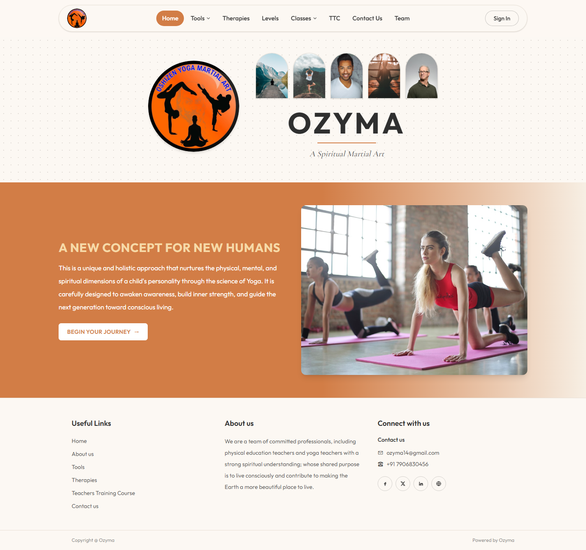

### Tools
Overview of practice tools with links into Pranayama and related paths.

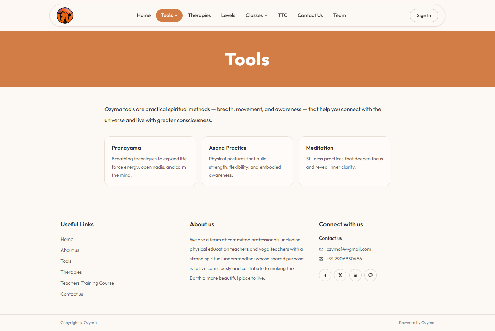

### Pranayama
Breathwork education with content and image gallery.

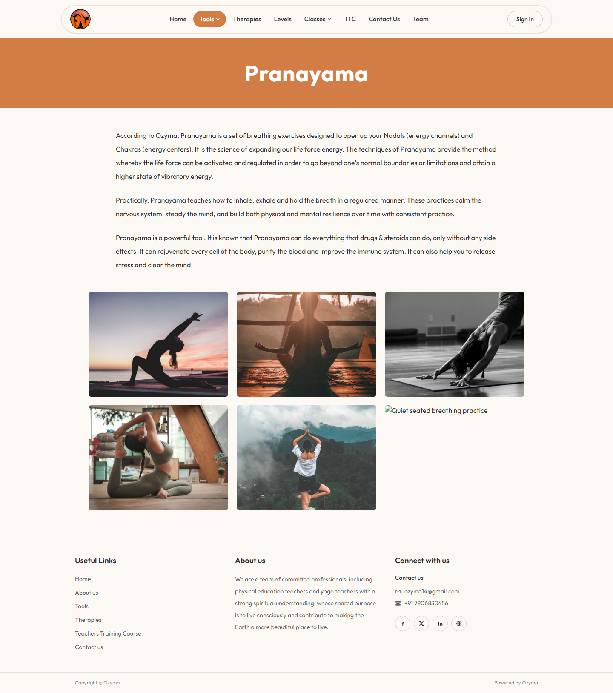

### Therapies
Therapy tabs (Pranic Healing, OHM, VOHM, Pancha Tatva, Panchakarma, Mud Therapy, Fire Bath) with scrollable sections.

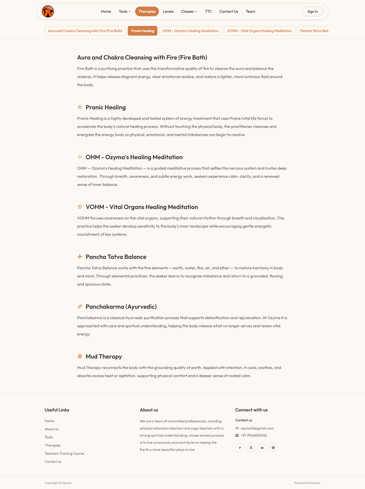

### Levels
Ozyma belt system mapped to chakras (White → Black), with level descriptions.

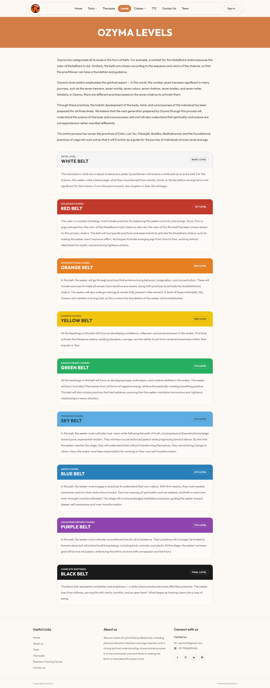

### Classes
Class formats and links to In Schools / Teachers Training.

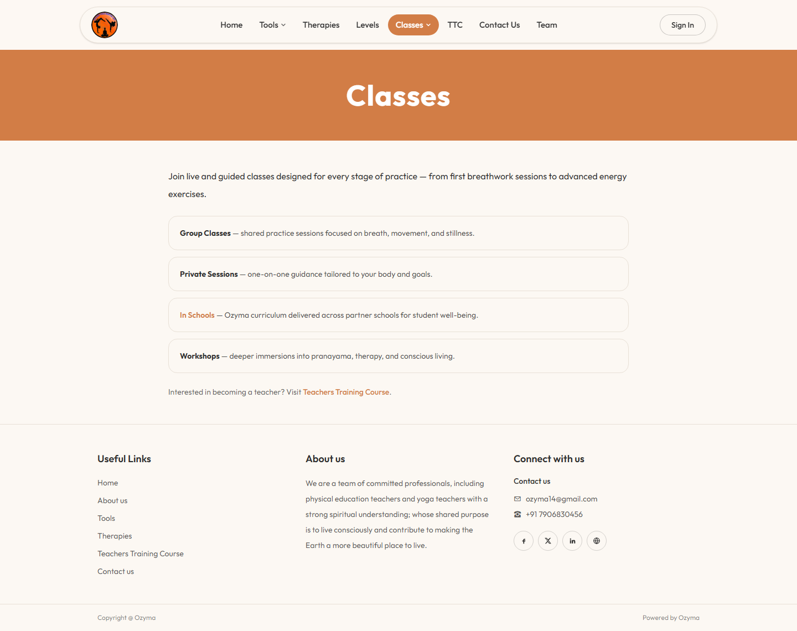

### In Schools
School partnership story, partner school grid, and program imagery.

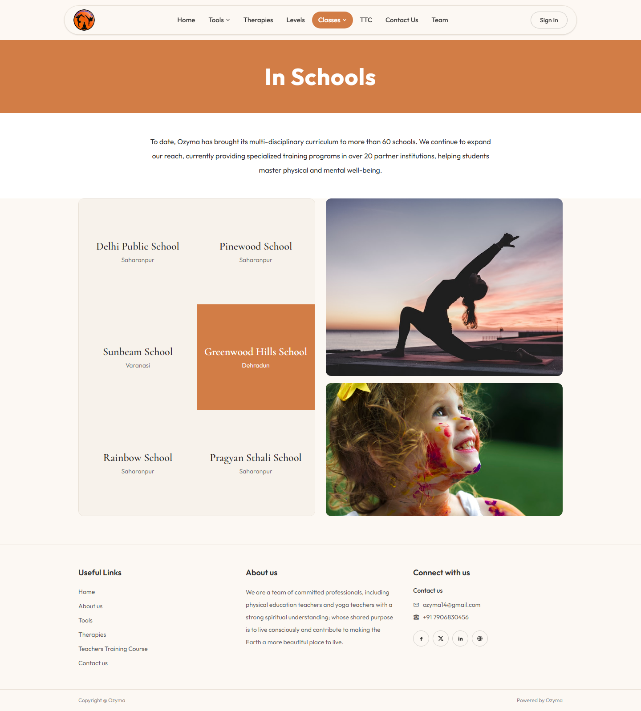

### Teachers Training Course (TTC)
TTC overview and enquiry call-to-action.

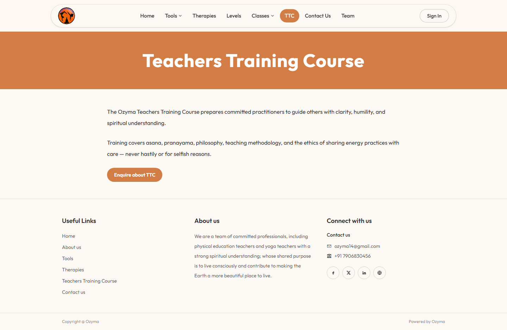

### Contact & Feedback
Contact form (saved to Neon) plus feedback list/submit from the database.

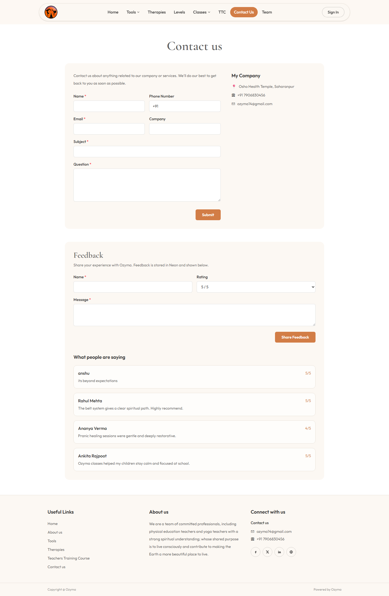

### Team
Faculty and mentor roles that support the Ozyma community.

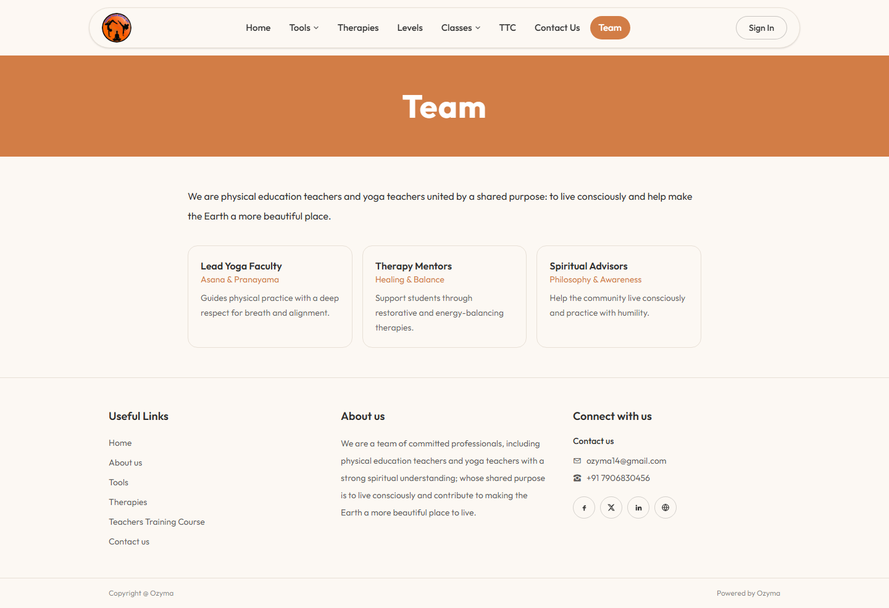

### About
Mission and spiritual foundation of the organization.

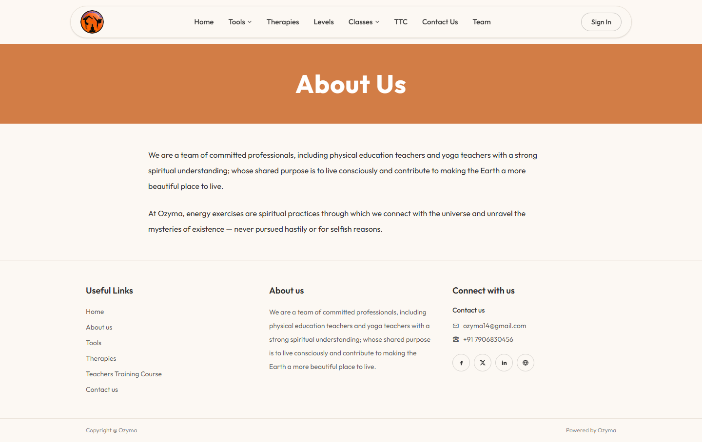

---

## Pages guide

| Route | Page | What it covers |
| --- | --- | --- |
| `/` | Home | Brand hero, masters, “A New Concept for New Humans”, CTA into Levels |
| `/tools` | Tools | Practice tools overview |
| `/tools/pranayama` | Pranayama | Breathing science, benefits, image gallery |
| `/therapies` | Therapies | Sticky therapy tabs + detailed sections |
| `/levels` | Levels | Chakra-aligned belt curriculum (entry → final) |
| `/classes` | Classes | Group / private / workshops + school & TTC links |
| `/classes/in-schools` | In Schools | 60+ schools narrative, partner grid, photos |
| `/ttc` | Teachers Training | Teacher training overview + contact CTA |
| `/contact` | Contact | Form → Neon `contacts`; feedback → Neon `feedback` |
| `/team` | Team | Team roles and purpose |
| `/about` | About | Organization about copy |

---

## Local development

```bash
git clone https://github.com/anshu292/anshu292.github.io.git
cd anshu292.github.io
git checkout source
npm install
cp .env.example .env   # fill Firebase + Neon values
npm run db:migrate
npm run dev
```

- Frontend: http://localhost:5173  
- API: http://localhost:3001 (proxied as `/api`)

### Environment variables

| Variable | Used for |
| --- | --- |
| `VITE_FIREBASE_*` | Client Firebase config + server token audience |
| `DATABASE_URL` | Neon pooled URL (API / Vercel) |
| `DATABASE_URL_UNPOOLED` | Migrations |
| `VITE_API_BASE_URL` | Leave empty on Vercel (same-origin `/api`) |

Never commit `.env`.

### Capture fresh screenshots

```bash
npm run screenshots
```

---

## Deploy to Vercel (recommended full stack)

```bash
npx vercel login
npx vercel --prod
```

Set Production env vars in the Vercel dashboard (all `VITE_FIREBASE_*` + `DATABASE_URL`).

Firebase Console → Authentication → Authorized domains → add `ozyma-website.vercel.app`.

Architecture on Vercel:

- Static Vite build on the CDN  
- `api/index.js` serverless Express for `/api/*`  
- Neon serverless driver for Postgres  

---

## GitHub Pages (UI only)

| Branch | Purpose |
| --- | --- |
| `source` | Full application source |
| `main` | Static production build for Pages |

Pages does **not** run the Express/Neon API — use Vercel for contact, feedback, and user sync.

---

## Scripts

| Command | Description |
| --- | --- |
| `npm run dev` | Local UI + API |
| `npm run build` | Production Vite build |
| `npm run db:migrate` | Ensure Neon tables exist |
| `npm run screenshots` | Capture live-site screenshots into `docs/screenshots` |
| `npm run deploy:vercel` | Deploy to Vercel production |

---

## Project structure

```text
src/                 React pages & components
server/              Express app + Drizzle schema
api/                 Vercel serverless entry
docs/screenshots/    README screenshots
public/              Logo & static assets
```

## License

Private / project use for Ozyma unless otherwise stated.
